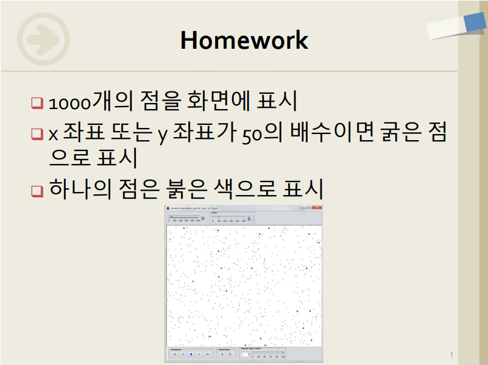
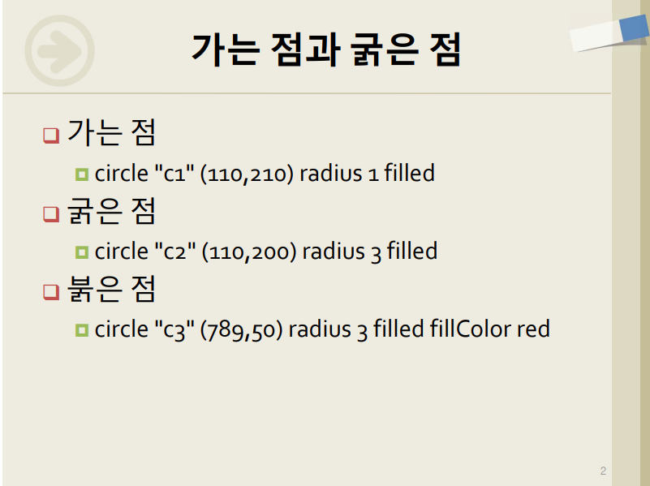
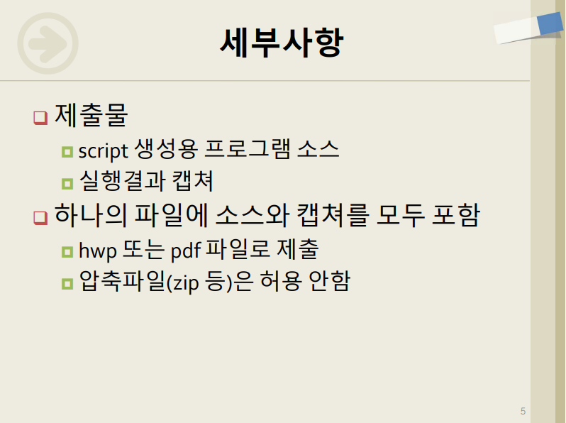
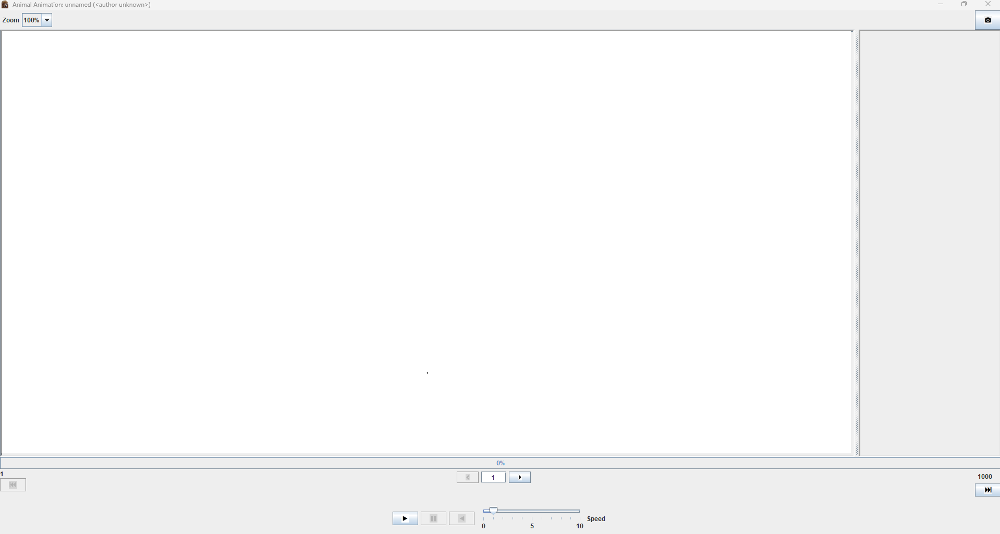
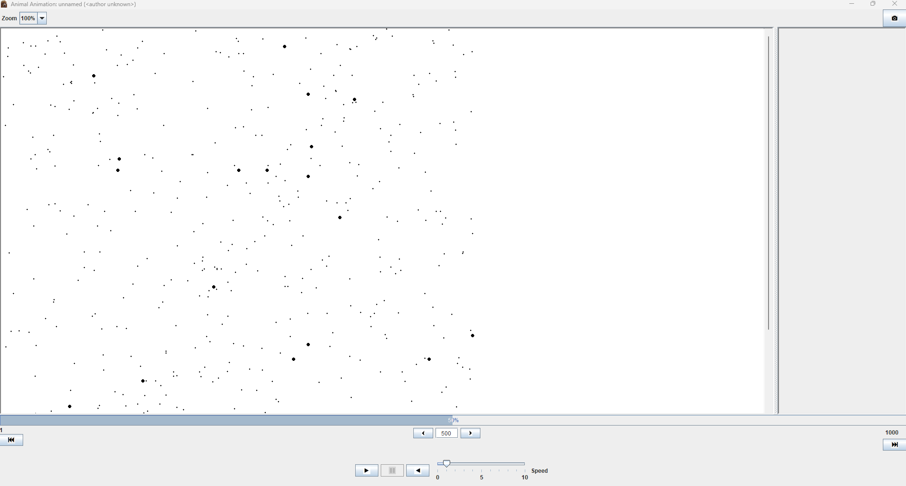

# Animal Animation 과제 보고서

- [_GitHub 바로가기_](https://github.com/jeongiryang/Algorithm_animal-animation_tool.git)

 - **과목:** 알고리즘
 - **학번:**  2022 2017
 - **이름:** 정이량

 ---

##  목차
1. [과제 개요](#1-과제-개요)
2. [과제 요구사항](#2-과제-요구사항)
3. [파일 및 폴더 구조](#3-파일-및-폴더-구조)
4. [실행 방법](#4-실행-방법)
5. [생성용 프로그램 소스코드](#5-생성용-프로그램-소스코드srcscriptpy)
6. [실행 결과 스크린샷](#6-실행-결과-스크린샷)
7. [소감](#7-소감)


 ---

## 1. 과제 개요
본 과제는 주어진 999개의 좌표 데이터(points.txt)와 본인의 학번을 활용하여 총 1,000개의 점을 특정 규칙에 맞게 화면에 렌더링하는 프로그램을 구현하는 것.

---

## 2. 과제 요구사항

강의 자료에서 제시된 핵심 요구사항을 분석하여 설계에 반영하였다.

| [01] 과제 기본 요건 | [02] 점 렌더링 세부 규칙 |
| :---: | :---: |
|  |   |
| ▲ 1,000개의 점 표시 및 50의 배수 강조 | ▲ 가는 점(Radius 1), 굵은 점(Radius 3) 구분 |

| [03] 입력 데이터 분석 | [04] 학번 기반 특수 점 계산 |
| :---: | :---: |
|   |   |
| ▲ points.txt (0 ~ 1000 범위의 999개 좌표) | ▲ 마지막 붉은 점: $x = (\text{학번}) \pmod{999}$, $y = (\text{학번}) \pmod{998}$ |

| [05] 제출 주의사항 |
| :---: |
|   |
| ▲ 소스 코드와 실행 결과 캡처를 하나의 HWP/PDF로 통합 제출 |

---

## 3. 파일 및 폴더 구조

```text
Assignment_Animal_Animation/
 ┣ src/script.py          # 애니메이션 스크립트를 생성하는 파이썬 소스 코드
 ┣ data/         # 입력 데이터 (points.txt)
 ┣ screenshots/   # 과제 제출용 실행 결과 캡처 이미지 모음
 ┗ README.md     # 결과 간단 보고서
 ```

---

## 4. 실행 방법

1. data 폴더 안에 points.txt 파일이 정상적으로 위치해 있는지 확인
2. 터미널 또는 명령 프롬프트에서 src 폴더로 이동
3. 아래 명령어를 입력하여 프로그램을 실행
   ```bash
   python script.py
   ```

## 5. 생성용 프로그램 소스코드(`src/script.py`)
   ```python
# 파일명: script.py

def create_script():
    # 본인 학번 설정 
    student_id = 20222017
    
    input_file = 'points.txt'
    output_file = 'animal_output.txt'

    try:
        # 1. 기존 좌표 데이터 파일 읽기
        with open(input_file, 'r') as f:
            lines = f.readlines()

        script_lines = []

        # 2. 999개의 점 처리 루프
        # points.txt에 있는 좌표를 하나씩 읽어서 circle 명령어로 변환함 
        for i, line in enumerate(lines):
            coords = line.split()
            if len(coords) < 2:
                continue
            
            x = int(coords[0])
            y = int(coords[1])

            # 조건 확인: x 또는 y가 50의 배수이면 radius를 3으로 크게 잡음 
            # 배수가 아니면 일반 점 크기인 1로 설정함 
            if x % 50 == 0 or y % 50 == 0:
                radius = 3
            else:
                radius = 1
            
            # AnimalScript 형식에 맞춰 circle 생성 (검은색 기본값) 
            # p0, p1... 이런식으로 id를 부여해서 중복되지 않게 함
            command = f'circle "p{i}" ({x}, {y}) radius {radius} filled'
            script_lines.append(command)

        # 3. 마지막 1000번째 점 (붉은 점) 추가
        # 문제에 제시된 공식: x = 학번 % 999, y = 학번 % 998 
        red_x = student_id % 999
        red_y = student_id % 998
        
        # 붉은 점은 fillColor red 속성을 추가하고 눈에 띄게 radius 3으로 고정함 
        red_dot_cmd = f'circle "red_dot" ({red_x}, {red_y}) radius 3 filled fillColor red'
        script_lines.append(red_dot_cmd)

        # 4. 최종 파일 저장
        with open(output_file, 'w') as out:
            out.write('\n'.join(script_lines))

        print(f"성공: {output_file} 파일이 생성됨.")
        print(f"계산된 붉은 점 좌표: ({red_x}, {red_y})")

    except FileNotFoundError:
        print(f"오류: {input_file} 파일을 찾을 수 없음.")

if __name__ == "__main__":
    create_script()

   ```


---

## 6. 실행 결과 스크린샷

- Animal 프로그램 특성에 맞춰 데이터가 순차적으로 렌더링되는 애니메이션 진행 단계별 화면.
- **_각 스크린샷은 배율 100%에서 캡쳐함_**

### [Step 1] 초기 렌더링 (진행률 1/1000)
- 첫 번째 좌표 데이터가 입력되어 화면에 첫 점이 찍힌 직후의 상태.


---

### [Step 2] 중간 렌더링 (진행률 500/1000)
- 절반의 데이터가 처리된 상태. 무작위 좌표에 점들이 분포하며, x 또는 y 좌표가 50의 배수인 위치에 **굵은 점(Radius 3)**이 정상적으로 렌더링됨.


---

### [Step 3] 렌더링 완료 (진행률 1000/1000)
- 999개의 일반 좌표 점과 **학번으로 계산된 마지막 붉은 점**까지 모두 렌더링 완료된 최종 100% 화면.
_진행률_1000.png)


---

## 7. 소감

- 제공된 숫자 좌표 데이터(txt)가 파이썬 스크립트 변환을 거쳐 시각적 애니메이션으로 구현되는 과정을 직접 확인하며 데이터 시각화의 기본 흐름을 이해함.

- 특히 조건문(50의 배수)과 모듈러 연산(학번)을 활용해 특정 데이터만 시각적으로 강조(굵기, 색상)하는 로직을 직접 구현하고, 그 결과물이 Animal 프로그램에 정확히 렌더링되는 것을 검증해 볼 수 있어 매우 유익했음.

- 어려웠던 것을 굳이 뽑자면 환경 구축에서 좀 애먹었음
   - 과제 수행 초기 환경 변수 지정 및 Animal 실행 파일 경로 인식 문제로 시행착오를 겪었으나, 이를 해결하며 터미널 환경에서의 파일 경로 관리와 개발 환경 설정의 중요성을 깊이 체감함.
